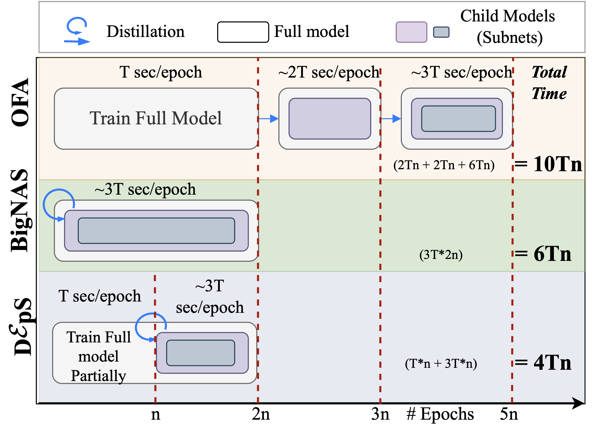
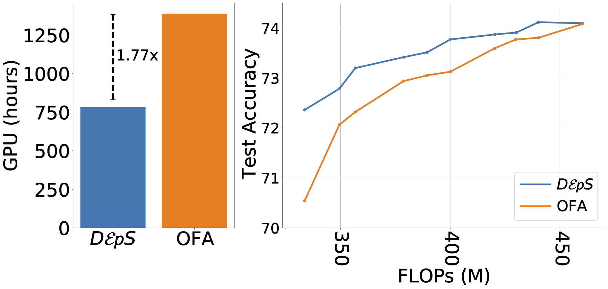
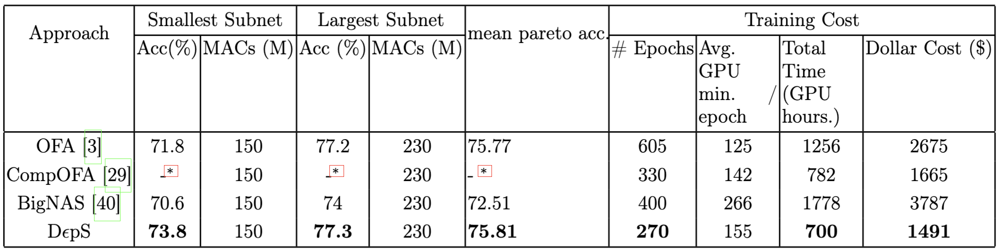
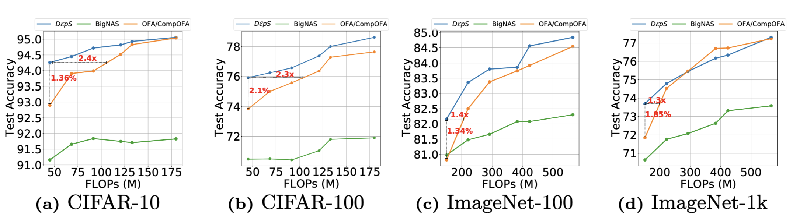
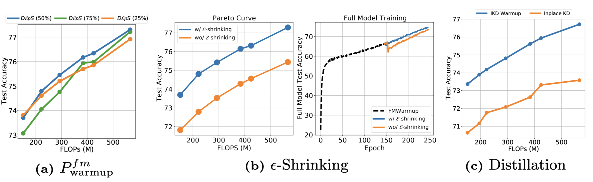

# DϵpS: Delayed ϵ-Shrinking for Faster Once-For-All Training [[arxiv]](https://arxiv.org/abs/2407.06167)

```BibTex
@inproceedings{deps-eccv2024,
      title={D{\epsilon}pS: Delayed {\epsilon}-Shrinking for Faster Once-For-All Training},
      author={Aditya Annavajjala^{*} and Alind Khare^{*} and Animesh Agrawal and Igor Fedorov and Hugo Latapie and Myungjin Lee and Alexey Tumanov},
      booktitle = {Proc. of the 18th European Conference on Computer Vision},
      series = {ECCV '24},
      month = {August},
      year = {2024},
      url={https://arxiv.org/abs/2407.06167},
}
```


## Overview


## Reduced training cost and improved performance
- DϵpS significantly reduces training cost while improving performance of subnetworks in the lower FLOPs range!



## Superior performance across the pareto frontier





## Role of different contributions to overall performance and cost



## How to use

### Evaluate checkpoints
To evaluate a checkpoint run the script located at `deps/evaluate.py` (it has the necessary instructions)

### Train your supernetwork

*MobileNetV3*
```
horovodrun -np 16 --start-timeout 300 -H 130.207.125.17:8,130.207.125.19:8 --network-interface=ens8f0 \
python train_net.py --task maxnet --exp_id deps@eccv_test --n_epochs 270 \
--base_lr 0.1625 --opt_type sgd --lr_schedule_type cosine --lr_schedule_param 2 \
--ks_list 7 --depth_list "2, 3, 4" --expand_list "3, 4, 6" --dropout 0.1 \
--dynamic_batch_size 4 --weight_decay 3e-5 --momentum 0.9 --base_batch_size 128 \
--bn_momentum 0.99 --lr_gamma 0.973 --dataset imagenet --label_smoothing 0.1 \
--auto_augment "imagenet" --n_worker 16 --bignas_lr_decay_step_size 0 --teacher_warmup 150 \
--gradient_aggregation sum --inplace_distillation --reorganize_weights --smallnet_warmup 5 \
--network_family mbv3 --distort_color torch --random_erase_prob 0.2 --mixup_alpha 0 --cutmix_alpha 0 --wandb
```

*Proxyless*
```
train_net.py --task teacher --exp_id RES5_Proxyless_Largest_16GPU \
--n_epochs 300 --base_lr 0.0125 --opt_type sgd --lr_schedule_type cosine \
--ks_list 7 --depth_list 4 --expand_list 6 --dropout 0 --dynamic_batch_size 1 \
--weight_decay 5e-5 --momentum 0.9 --base_batch_size 64 --bn_momentum 0.99 \
--dataset imagenet --label_smoothing 0.1 --n_worker 8 --lr_gamma 1 --warmup_epochs 5 \
--manual_seed 42 --random_erase_prob 0.2 --mixup_alpha 0.1 --cutmix_alpha 0.1 \
--warmup_lr 0 --wandb --network_family proxyless --distort_color torch
```


## Requirements
* Python 3.6.13+
* Pytorch 1.10.0+
* Horovod 0.19.2

Check setup/ for environment setup instructions

